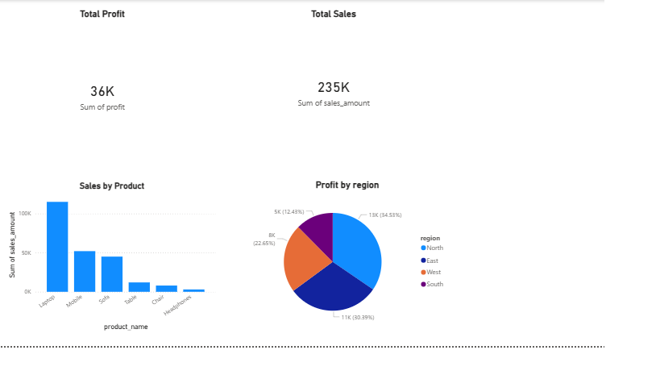

# 📊 Sales Analytics Dashboard (Power BI Project)

## 📌 Project Overview
This project demonstrates end-to-end data analysis using Excel, SQL, and Power BI.  
The objective was to analyze sales data, identify trends, and generate actionable business insights.

---

## 🛠 Tools & Technologies Used
- Microsoft Excel (Data Cleaning)
- SQL (Data Modeling & Queries)
- Power BI
  - Power Query
  - Data Modeling
  - DAX
  - Dashboard Design

---

## 📂 Project Structure
- data/ → Raw sales datasets
- sql/ → SQL scripts for table creation
- powerbi/ → Power BI dashboard file (.pbix)
- images/ → Dashboard screenshots

---

## 📊 Key Insights
- Total Sales: 235K
- Total Profit: 36K
- Highest Sales Product: Laptop
- Most Profitable Region: North
- Sales contribution by product category analyzed

---

## 📷 Dashboard Preview

---

## 🚀 Business Impact
This dashboard enables management to:
- Monitor overall performance
- Identify profitable regions
- Track product-level sales trends
- Make data-driven decisions

---

## 👤 Author
Anusha Vennapusa  
Aspiring Data Analyst | Power BI Enthusiast
Maintained by anushavennapusa

